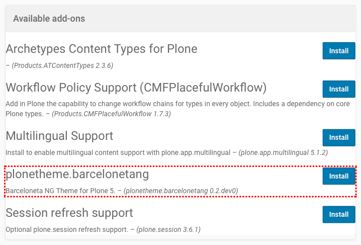
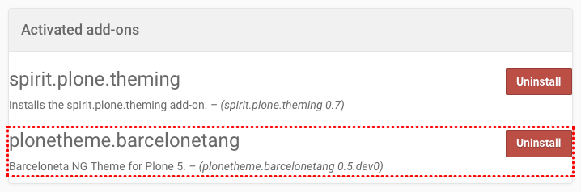
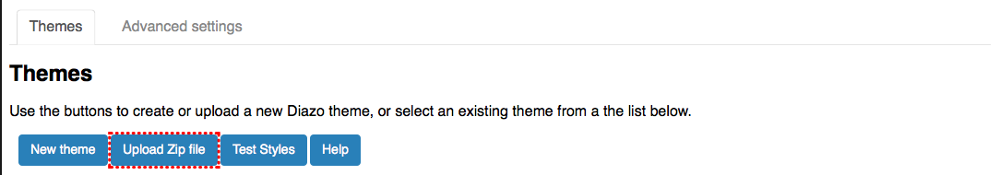
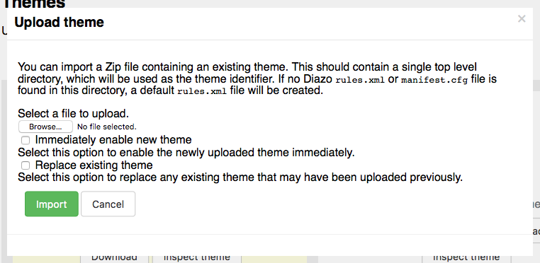

==================
Theme Installation
==================

This theme can be installed in two ways: as an add-on through the *Add-ons Control Panel* and via zip upload through the *Theming Control Panel*.

Install Theme Add-On
=====================

If your theme is available as an installable add-on on your Plone server, this option is for you.

Activate The Theme
------------------

You can install the theme like any other Plone add-on:

#. Click on your username in the *personal tools menu* and select **Site Setup**
#. Click the **Add-Ons** item in the *General* section

You should see an item called **plonetheme.barcelonetang**.
To install the theme, click the **Install** button next to the add-on:

   Add-on in the list of available add-ons

Once the theme is installed, it is automatically activated.

Deactivate The Theme
--------------------

You can uninstall the **plonetheme.barcelonetang** theme again from your Plone site by clicking the **Uninstall** button next to the add-on:

   Uninstall the add-on

Once the theme is deactivated in your Plone site, the default *Barceloneta* theme will be activated again.

.. note::

   You can also deactivate the theme temporarily in the *Theming Control Panel* without uninstalling the add-on.

Upload Theme As ZIP File
========================

If this theme is not available as an installable add-on on your Plone server, you can upload the theme as a ZIP file using the *Theming Control Panel*:

#. Click on your username in the *personal tools menu* and select **Site Setup**
#. Click the **Theming** item in the *General* section

To upload your theme, click on the **Upload Zip file** button:

   Upload theme as zip file

This will open the **Upload theme** dialog.
Click on the **Browse...** button and select the ZIP file from your computer.
Activate the checkbox **Immediately enable new theme**, so that your theme will be activated immediately and click the **Import** button to start the upload process.

   Import theme as zip file
