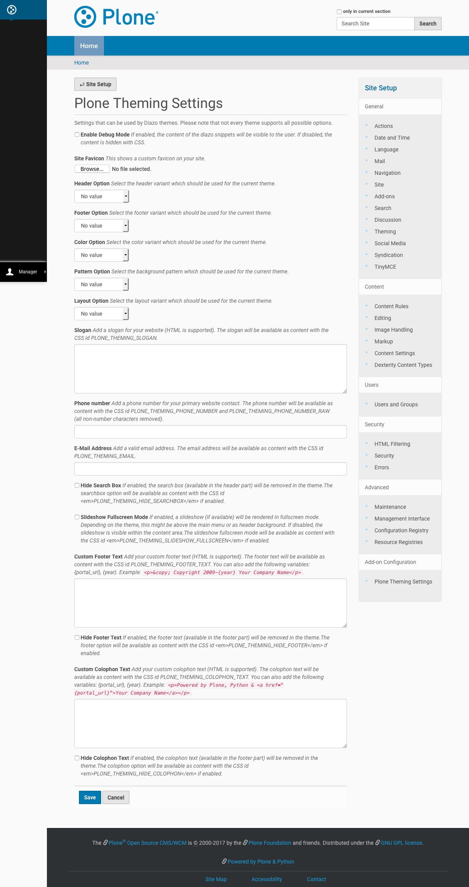

===============================
Theme Options And Configuration
===============================

.. toctree::
   :maxdepth: 2
   :hidden:
   :caption: Options

   Options <options>
   Headers <headers>
   Footers <footers>
   Colors <colors>
   Patterns <patterns>
   Layouts <layouts>

This section will show you how to configure your theme with the `Plone Theming Settings <https://spiritplonetheming.readthedocs.io>`_ add-on.

To adjust the settings for the theme:

#. Click on your username in the *personal tools menu* and select **Site Setup**
#. Click the **Plone Theming Settings** item in the *Add-on Configuration* section

   Plone Theming Settings for the theme
