=================
Available Options
=================

Enable Debug Mode
=================

Shows the content of the **Plone Theming Settings** in the frontend.
Only activate this for local development.

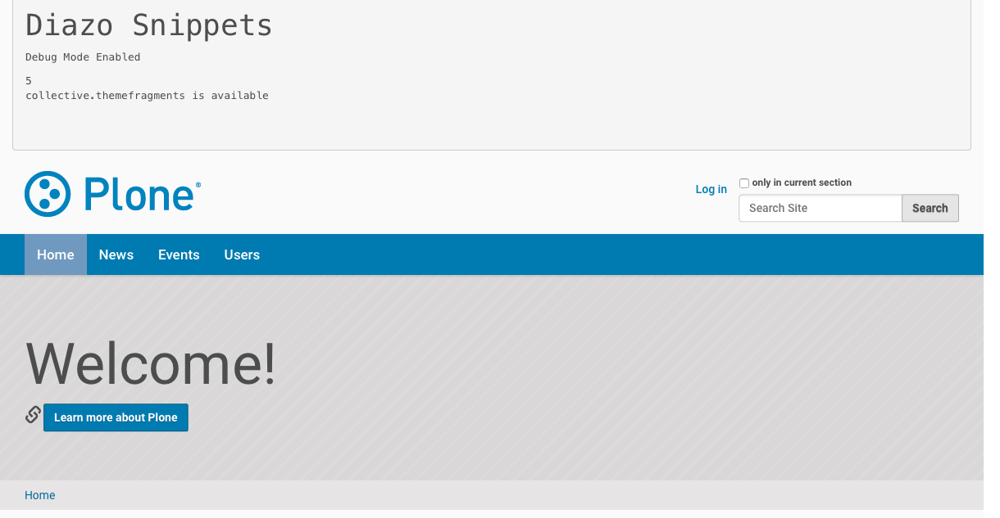

   Debug option activated

Site Favicon
============

You can upload a custom favicon for your Plone site.
Any image format can be uploaded, but \*.ico and \*.png files work best.
If no custom icon is set, Plone's default favicon will be used.

Header Option
=============

The theme currently supports the following header options:

- ``header-default``

The default option is ``header-default``:

.. figure:: ../../_images/settings-header_option--default.png

   Header option: default

You can see examples of all header variants in the section about :doc:`the available header options <headers>`.

Footer Option
=============

The theme currently supports the following footer options:

- ``footer-default``

The default option is ``footer-default``:

.. figure:: ../../_images/settings-footer_option--default.png

   Footer option: default

You can see examples of all footer variants in the section about :doc:`the available footer options <footers>`.

Color Option
============

The theme currently supports the following color options:

- ``aqua``
- ``blue``
- ``brown``
- ``green``
- ``orange``
- ``purple``
- ``red``

The default option is ``blue``:

.. figure:: ../../_images/settings-color_option--default.png

   Color option: default

You can see examples of all color variants in the section about :doc:`the available color options <colors>`.

Pattern Option
==============

The theme currently supports the following pattern options:

- ``none``

The default option is ``none``:

.. figure:: ../../_images/settings-pattern_option--default.png

   Pattern option: default

You can see examples of all pattern variants in the section about :doc:`the available pattern options <patterns>`.

Layout Option
=============

The theme currently supports the following layout options:

- ``boxed``
- ``wide``

The default option is ``wide``:

.. figure:: ../../_images/settings-layout_option--default.png

   Layout option: default

You can see examples of all layout variants in the section about :doc:`the available layout options <layouts>`.

Slogan
======

Add a slogan for your website (HTML is supported).
The slogan will be shown in the header section.

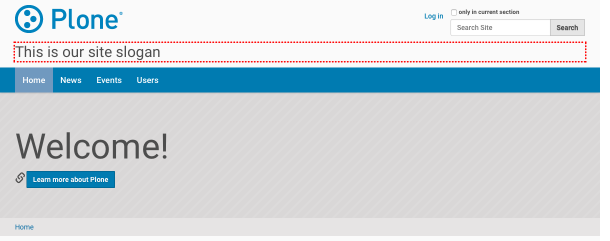

   Slogan in the header

If no slogan has been added, nothing will be shown.

.. figure:: ../../_images/settings-slogan--deactivated.png

   No slogan in the header

Phone Number
============

Add a phone number for your primary website contact.
The phone number will be shown in the header section.

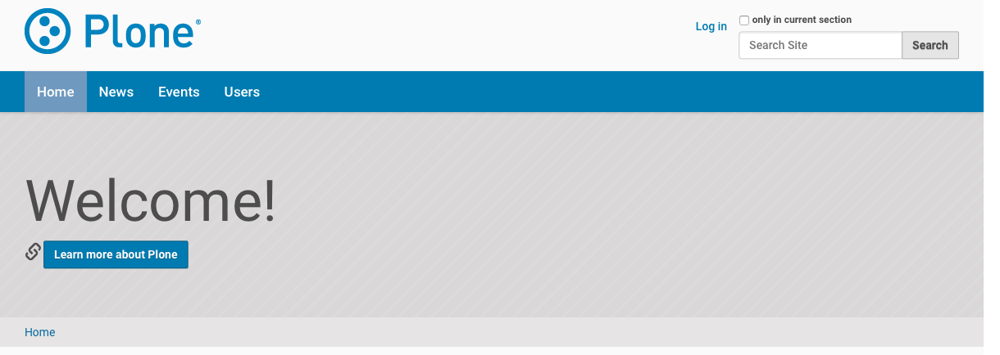

   Phone number in the header

If no phone number has been added, nothing will be shown.

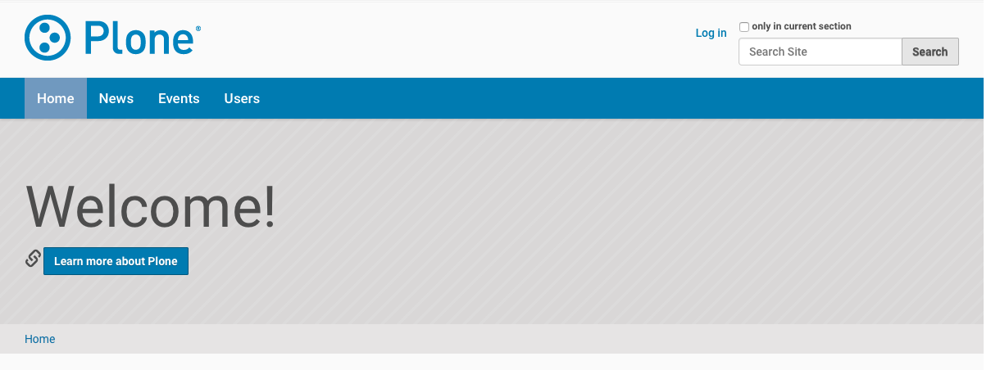

   No phone number in the header

E-Mail Address
==============

Add a valid email address.
The e-mail address will be shown in the header section.

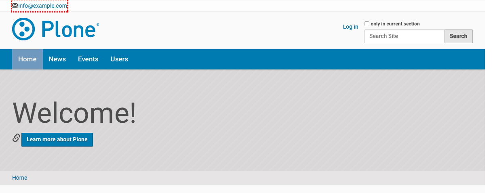

   E-Mail address in the header

If no e-mail address has been added, nothing will be shown.

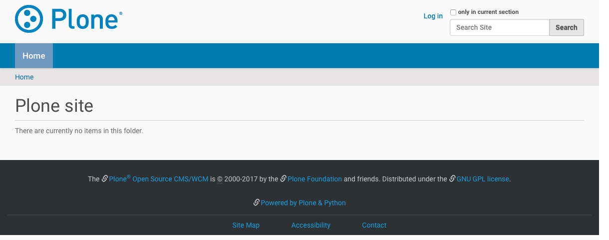

   No a-mail address in the header

Hide Search Box
===============

If enabled, the search box (available in the header part) will be removed in the theme.

.. figure:: ../../_images/settings-hide_searchbox--activated.png

   Hide search box activated

Slideshow Fullscreen Mode
=========================

This option is currently not supported.

Custom Footer Text
==================

Add your custom footer text (HTML is supported).
This will replace the footer content coming from Plone.

Example:

.. code-block:: html

   
&copy; Copyright 2009-{year} Your Company Name

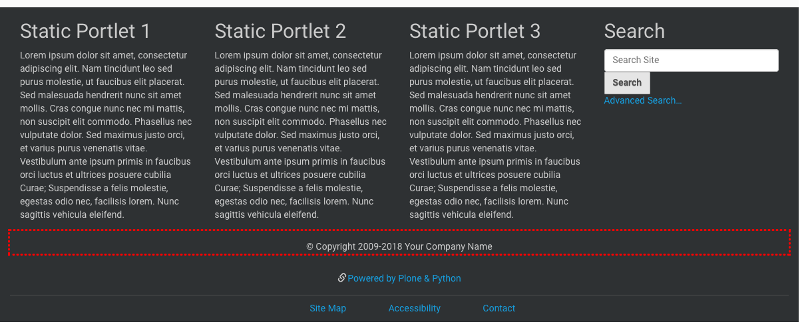

   Custom footer text activated

If no text has been added, the default footer text from Plone will be shown.

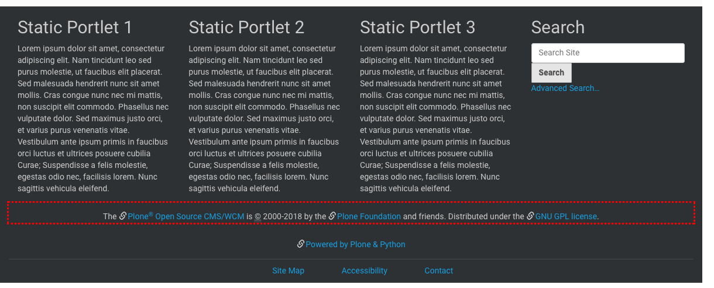

   Custom footer text deactivated

Hide Footer Text
================

If enabled, the footer text (available in the footer part) will be removed in the theme.

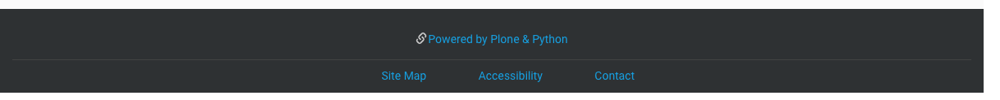

   Hide footer text activated

Custom Colophon Text
====================

Add your custom colophon text (HTML is supported).
This will replace the colophon content coming from Plone.

Example:

.. code-block:: html

   
Powered by Plone, Python &amp; <a href="{portal_url}">Your Company Name</a>

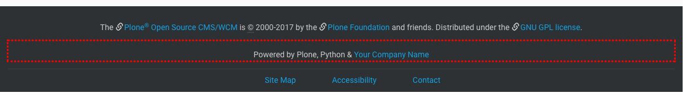

   Custom colophon text activated

If no text has been added, the default colophon text from Plone will be shown.

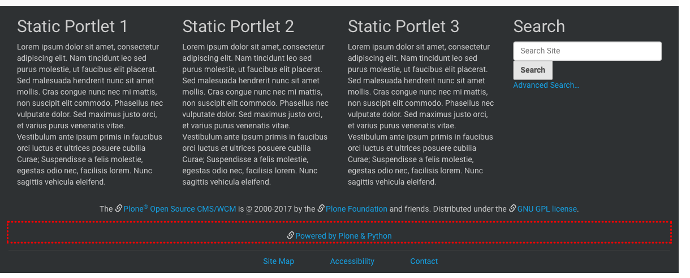

   Custom colophon text deactivated

Hide Colophon Text
==================

If enabled, the colophon text (available in the footer part) will be removed in the theme.

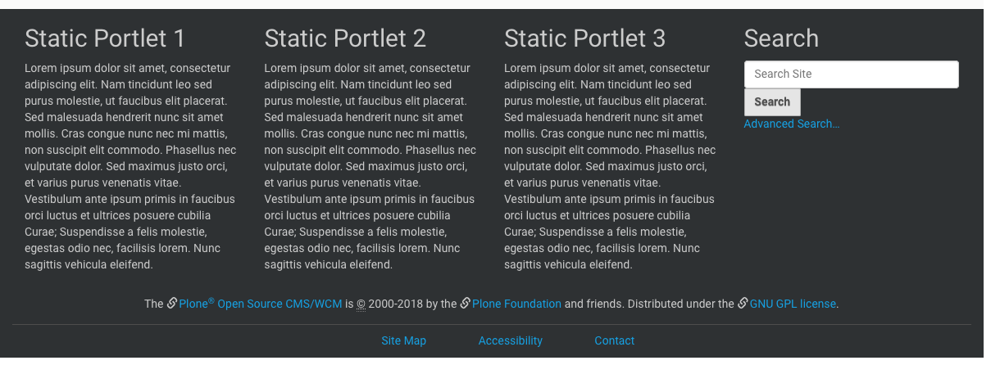

   Hide colophon text activated
